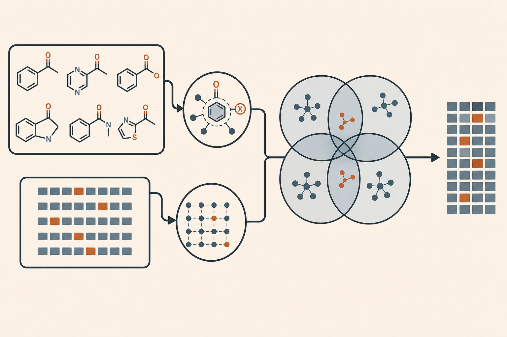

# CONDUCTOR Clustering機能ガイド

CONDUCTORでは局所化合物群を作る処理をGrouping、一般利用時はClusteringと呼びます。Groupは排他的である必要はなく、一つの化合物が複数Groupへ所属できます。

## 二つの入口

1. **Direct structure** — compound IDとSMILESを持つCSVを読み、scaffold、MCS、fragmentで分類します。
2. **Description vector** — Description SkillのVector artifactを入力し、その表現空間内で分類します。

入力と意味が異なるため、両者は別Capabilityとして扱います。

## 機能一覧

| ID | Clustering | 入力 | 役割・特徴 |
|---|---|---|---|
| C001 | Murcko scaffold | ID/SMILES CSV | 中心骨格が同じ化合物をまとめる |
| C002 | MCS | ID/SMILES CSV | 共通部分構造を核に重複可能なGroupを作る |
| C003 | BRICS | ID/SMILES CSV | 合成上意味のある切断規則によるfragment Group |
| C004 | RECAP | ID/SMILES CSV | 反応規則に基づくfragment Group |
| C005 | Vector Butina | Description artifact | 類似度閾値に基づく代表中心型partition |
| C006 | Hierarchical | Description artifact | 距離の階層構造を切ってGroup化する |
| C007 | DBSCAN | Description artifact | 密度領域を抽出しnoiseを許容する |
| C008 | Louvain | Description artifact | 近傍graphのcommunityを検出する |
| C009 | Leiden | Description artifact | 安定性を重視したcommunity検出 |
| C010 | Connected components | Description artifact | 類似度graphの連結成分をGroupとする |
| C011 | Categorical | Category CSV | assay条件など人間由来のカテゴリで分ける |
| C012 | Meta-overlap | Group membership | Group間重複から上位Groupを作る |

## 基本計算での扱い

Direct structure Groupingを実行し、Vector Clusteringは人間管理profileが指定した互いに異なるDescription familyの代表へ全applicable algorithmを実行します。MCSは基本計算に含み、事前承認を必要としません。特定Operator専用のGrouping sourceをcodeへ固定しません。

## MCS

MCSは構造Groupingの中心的手法です。複数parameter設定から異なる共通構造Groupを形成でき、重複所属を保持します。pair数が上限を超える場合はseed付き一様ランダム非復元抽出を行います。

- 最小Group size: 既定3
- pair上限: 最大1000
- 生成Group上限: 既定300
- 基本計算: 必須、事前承認不要

## Vector ClusteringのMetric

Metricはalgorithm名ではなく入力Descriptionの性質から決定します。

- binary fingerprint: Tanimotoのみ
- USR / USRCAT: Manhattan
- embedding、SVD、疎なcount: Cosine
- dense continuous descriptor: 標準化Euclidean

## Group管理

各GroupにはRun内で一意な`G######`を付けます。由来は`group_registry.csv`、所属はcompoundを行、Group IDを列とするBoolean CSVへ集約します。排他的partition、重複可能集合、noiseを区別し、比較不能なGroup間統計を作りません。

Groupを当面の探索対象から外しても削除せず`deprioritized`として保持します。重要度は後のFinding、Question、人間指示により変更できます。
