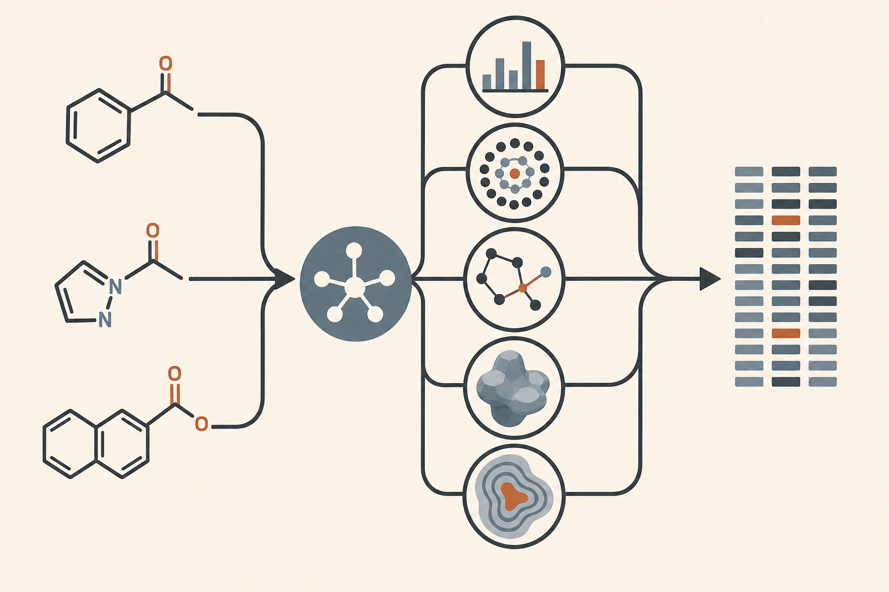

# CONDUCTOR Description機能ガイド

Descriptionは、化合物を解析可能な数値Vectorへ変換する入口です。同じ化合物でも表現ごとに近さや差が変わるため、CONDUCTORは互いに性質の異なるDescriptionを組み合わせます。

## 機能一覧

| ID | Description | 主に表すもの | 特徴 |
|---|---|---|---|
| D001 | RDKit 2D descriptors | 分子量、極性、疎水性など | 解釈しやすい連続物性 |
| D002 | Morgan fingerprint | 原子周辺の局所環境 | chirality等のvariantを選択可能 |
| D003 | MACCS keys | 定義済み部分構造 | 解釈しやすい構造key |
| D004 | Hashed atom-pair | 原子対と距離 | 離れた原子関係を含むcount表現 |
| D005 | Topological torsion | 連続4原子の結合pattern | 局所的な結合列を捉える |
| D006 | RDKit fragment counts | 官能基・部分構造数 | 人間の化学的説明へ接続しやすい |
| D007 | RDKit path fingerprint | 結合path | 分子graph上の経路類似性 |
| D008 | RDKit pattern fingerprint | 部分構造pattern | query的な部分構造の有無 |
| D009 | RDKit layered fingerprint | 複数階層のpath情報 | 原子・結合情報を層別に反映 |
| D010 | Avalon fingerprint | 部分構造・path | RDKit系とは異なる設計 |
| D012 | RDKit 3D descriptors | 3D形状・慣性・表面 | conformerから連続3D記述子を生成 |
| D013 | USR / USRCAT | 3D形状と薬理学的原子型 | 高速なshape/pharmacophore比較 |
| D014 | Basic 3D shape | 形状、サイズ、扁平性 | 少数の分かりやすい3D指標 |
| D015 | Mordred 2D | 広範な2D数理記述子 | 高次元で網羅的 |
| D016 | Mordred 3D | 広範な3D数理記述子 | 高コスト・single conformer依存 |
| D017 | Gobbi Pharm2D | 2D pharmacophore | foldedまたはSVD表現 |
| D019 | Pretrained embedding | 学習済み潜在表現 | model依存・GPU候補 |
| D020 | GFN2-xTB descriptors | 電子状態・量子化学的性質 | 非常に高コスト |

D011とD018はD002のchirality option、D017のSVD optionへ統合しているため欠番です。

## 基本計算での扱い

人間から明示的な省略指示がない限り、Catalog profileで有効かつ実行可能な全Descriptionを一度生成します。高コストDescriptionも黙って除外せず、Run開始時にinput、profile、設定、resource envelopeへ紐付けた一括bundleとして承認します。

全Descriptionを計算しても、すべての下流組合せを直ちに実行するわけではありません。初期探索はfamilyの異なる共通master panelを用い、追加探索と深掘りで残りの組合せを利用します。

## 入出力

- CSV入力と単一・複数SMILES入力に対応します。
- IDのないSMILESには自動IDを付与します。
- invalid SMILESは行を保持し、warningと欠損Vectorを記録します。
- 異なるcompound IDから同一Vectorが生成されても正常です。
- 一般利用では主にDescription CSVを返します。
- CONDUCTOR利用ではrepresentation family、value semantics、natural metric、seed等をmanifestへ付加します。

## Metricとの関係

| 表現 | 原則Metric |
|---|---|
| binary fingerprint | Tanimoto |
| USR / USRCAT | Manhattan |
| embedding / SVD / 疎なcount | Cosine |
| dense continuous descriptors | 標準化Euclidean |

詳細な直交性と重複関係は[Description間の関係性とカバー範囲](CONDUCTOR_v4_description_relationships_and_coverage.md)を参照してください。
