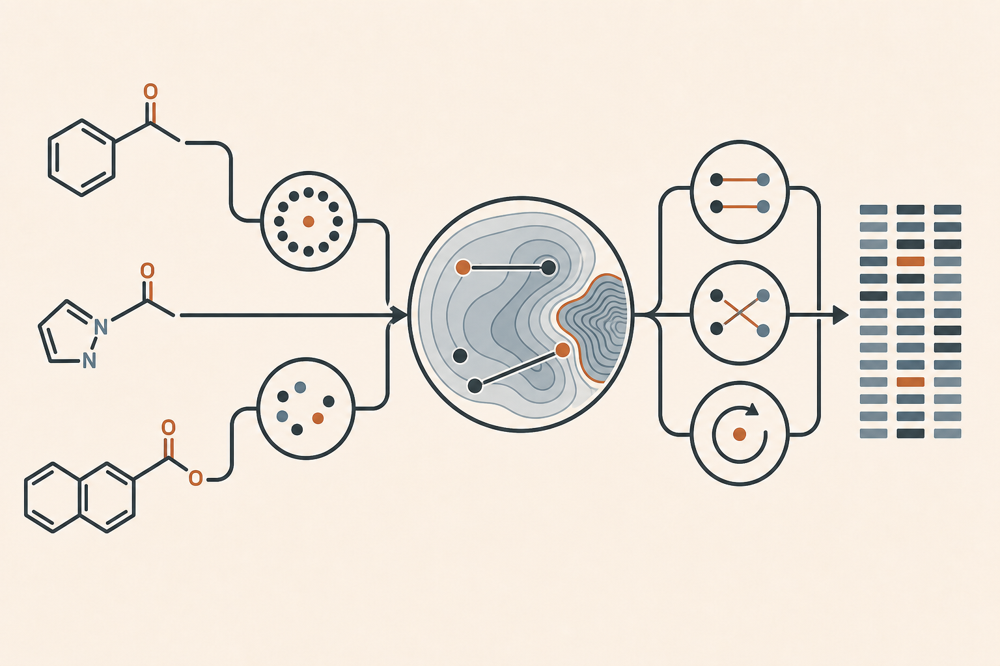

# CONDUCTOR Operator機能ガイド

Operatorは、Description空間、構造、活性値、Group membershipを使ってEvidenceを作る解析単位です。全化合物、Group内、Group間、明示的なcompound集合へ適用できます。

## 機能一覧

| ID | Operator | 主な問い | 主な出力 |
|---|---|---|---|
| A001 | Group profile | Groupの活性水準とばらつきはどう違うか | 件数、平均、中央値、分位点 |
| A002 | Activity distribution | endpointはどのような分布か | 分布統計、欠損、外れ値候補 |
| A003 | Pairwise structure similarity | 全体・局所の構造類似性は高いか | 類似度分布、上位pair |
| A004 | Descriptor–activity correlation | 特徴量と活性は関連するか | 相関、順位、符号 |
| A005 | kNN activity consistency | 近傍は似た活性を持つか | 近傍活性差、整合性 |
| A006 | Extended SALI | 活性Landscapeは平滑かCliff的か | SALI分布、upper tail、focus pair |
| A007 | Activity cliff detection | 高類似・大活性差pairはどこか | Cliff候補、密度、score |
| A008 | Group enrichment | 高活性化合物はGroupに濃縮するか | enrichment、odds ratio、検定値 |
| A009 | Group overlap | Group同士はどの程度重なるか | intersection、union、Jaccard |
| A010 | Group structural diversity | Group内部は構造的にまとまるか | 平均類似度、多様性score |

## 初期探索

global waveでは、全体scopeに対して全applicable Operator roleを実行します。local waveでは、各Groupingから選んだ通常2～4の代表Groupに対して全applicable local Operator roleを実行します。特定Descriptionや特定Groupingだけへ特定Operatorを割り当てる固定表は用いません。

同じOperatorをglobal、local、sibling Group、outside controlで比較することで、Groupingによって解釈がどう変わるかを確認します。排他的partitionと重複Groupは別の統計的意味として扱います。

## SALIの読み方

- 大きいSALIは、近いVector間の大きな活性差と局所Cliffの可能性を示します。
- 小さいSALIは、その表現空間でLandscapeが比較的平滑である可能性を示します。
- raw値はendpoint scaleとMetricに依存し、異Metric間で単純比較しません。
- median、upper tail、有効pair数、top pairを併記します。

## 計算結果とCONDUCTOR adapter

数式と数値CSVを作る科学計算Kernelは、今回のrefactorでも原則維持します。CONDUCTOR利用ではadapterがRun内`E######`、scope、provenance、比較可能性、compact digest、機械可読Evidence、個別HTML reportを付加します。一般利用では`--conductor`を付けず、通常の出力を得ます。

## Interpretationへの接続

Operatorは結論ではなくEvidenceを出します。Interpretationはdigest索引から必要なEvidenceだけを詳細確認し、次を区別します。

- 類似Descriptionに由来する当然の一致
- 独立性の高いDescription間での一致
- global/localの変化または反転
- sibling Group間の差、矛盾、例外
- negative result、control、反証

Finding、Hypothesis、Question、RelationはRoundごとに採番し直さず、Run内通番で引き継ぎます。重要度は可変であり、routine Evidenceも新しい関係から再評価できます。
