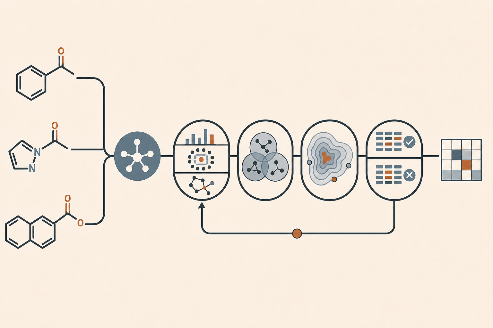

# CONDUCTOR 全体ガイド

CONDUCTORは、化合物の構造と活性値からSARを反復的に探索する解析システムです。異なるDescription、Grouping、Operatorの結果を全体と局所で比較し、人間が見落としやすい変化、矛盾、例外、Activity Cliffを発見候補として提示します。

## 一回で終わらない解析

同じinput、endpoint、方向を扱う解析全体を**Run**、人間の指示からOrchestratorが成果またはcheckpointを返す一サイクルを**Round**と呼びます。一つのRunは複数Roundを前提とし、前Roundの成果、未解決Question、人間の重点指示を次Roundへ引き継ぎます。

## 解析の流れ

1. **Description** — 物性、部分構造、fingerprint、3D形状、学習済み・量子化学表現を生成します。
2. **Grouping** — SMILESの構造規則またはDescription空間から、局所化合物群を作ります。
3. **Operator** — 全体、Group内、Group間で分布、相関、近傍整合性、SALI、Cliff、濃縮などを評価します。
4. **Interpretation** — Evidenceを比較し、Finding、矛盾、反証候補、Hypothesis、Questionを整理します。
5. **Orchestration** — coverage、DAG、Question、可変な重要度を管理し、次の解析bundleを選びます。

## 四つの解析タイプ

| タイプ | 目的 |
|---|---|
| 基本計算（`basic_compute`） | 全Descriptionと、異なる表現familyを代表するGroupingを揃える |
| 初期探索 | globalでは全applicable Operator、各Groupingの代表Groupでは全applicable local Operatorを実行する |
| 追加探索 | 未実施cellを偏りの少ないseed付きランダム抽出で追加する |
| 深掘り解析 | Questionを起点にglobal/local、sibling Group、異Description、反証を比較する |

高コストDescriptionを含む基本計算はRun開始時に一括承認します。初期探索の後も、一つの結果だけで結論を出さず、別表現、別Group、別Operator、outside controlを組み合わせます。

## 疎結合とDAG

各Skillは入力と出力の契約を持つ独立部品です。OrchestratorはCatalogからCapabilityを選び、実行NodeをState内のDAGへ登録します。DAGは上流から下流への依存を有向に表し、循環を許さないため、再開、重複回避、stale伝播、結果の由来追跡に使えます。

DAGだけへ全情報を詰め込まず、Round、coverage、Group membership、Evidence digest、Question、salienceは軽量な索引で管理します。Orchestratorはまずboundedな`orchestrator_brief.json`を読み、必要な箇所だけ詳細を開きます。

同じRunを変更できるOrchestratorは単一Writer leaseを取得した一つだけです。Nodeの再試行は別Nodeではなく同じNode内のexecution attemptとして記録します。成功Operator EvidenceがあるRoundは、InterpretationのJSON／Markdown／HTMLとFull Auditが揃わなければ完了できません。

## 結果は残し、重要度は変える

全Operator artifactは保存します。重要性は`untriaged`、`routine`、`candidate`、`priority`等の可変indexで管理し、別の発見との関係から再評価できます。重要でないと判断した結果も削除や永久除外をしません。

## 一般利用とCONDUCTOR利用

- **一般利用**: 個別Skillを単独で呼び、`--conductor`を付けず通常のCSV等を得ます。
- **CONDUCTOR利用**: OrchestratorがNodeを予約し、明示的に`--conductor`を付け、manifest、Evidence、HTML、eventをStateへ連動させます。

## 人間が担うこと

- compound ID、SMILES、分子標準化、endpointの品質
- `higher_is_better`、並列数、Round resource envelopeの指定
- 高コスト基本計算bundleと追加高コスト深掘りの承認
- Questionの`allow/skip/defer`と科学的・実験的な最終判断

## 関連資料

- [Description機能](CONDUCTOR_v4_description_features.md)
- [Clustering機能](CONDUCTOR_v4_clustering_features.md)
- [Operator機能](CONDUCTOR_v4_operator_features.md)
- [Description間の関係性とカバー範囲](CONDUCTOR_v4_description_relationships_and_coverage.md)
- [正本ドキュメント一覧](../README.md)
